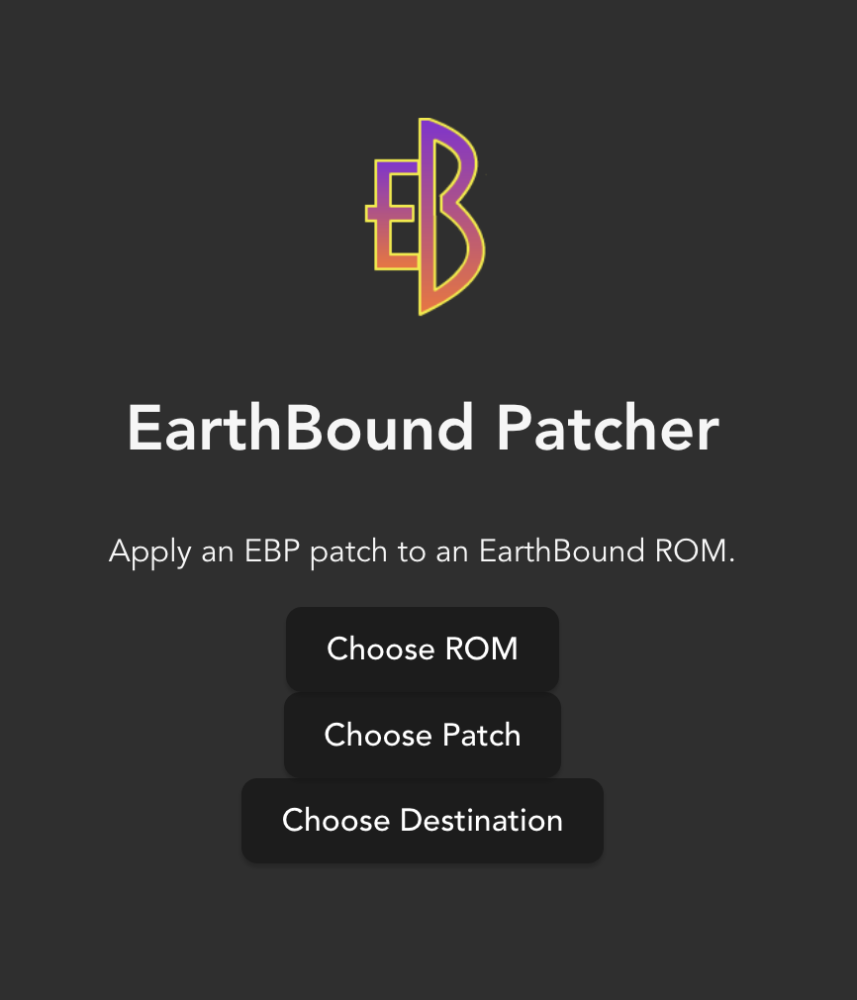

# EarthBound Patcher

An UNFINISHED recreation of [Lyrositor's EBPatcher](https://github.com/Lyrositor/EBPatcher) in Rust with Tauri + Svelte.

Most ROM hacks use IPS, xdelta, or another common patching format. Select EarthBound ROM hacks have
opted for the custom EBP (EarthBound Patch) file format, which requires the EBPatcher tool linked
above. That only has a Windows download and I can't for the life of me get PyQt5 installed on
macOS, so I gave up using it and decided to rewrite it.

EDIT: I since learned that the EBP format is actually just [IPS](https://github.com/Lyrositor/EBPatcher/blob/master/EBPPatch.py#L30)
with a custom JSON header that contains metadata about the patch. I removed the header and used a normal IPS patcher.
